# РАЗРАБОТКА ИГРОВЫХ СЕРВИСОВ
Отчет по лабораторной работе #2 выполнил:
- Абзапаров Николай Дмитриевич
- РИ300012
### Ссылка на репозиторий с проектом: https://github.com/Abzaparov-Nikolay/DragonPicker

Отметка о выполнении заданий (заполняется студентом):

| Задание | Выполнение | Баллы |
| ------ | ------ | ------ |
| Задание 1 | * | 60 |
| Задание 2 | * | 20 |
| Задание 3 | # | 20 |

знак "*" - задание выполнено; знак "#" - задание не выполнено;

Работу проверили:
- к.т.н., доцент Денисов Д.В.
- к.э.н., доцент Панов М.А.
- ст. преп., Фадеев В.О.

## Цель работы
Создание приложения и изучение способов интеграции в него игровых сервисов Яндекс.Игры
## Задание 1
1) Созданить новый 3D проект Unity
2) Добавить ассет с моделью дракона в свой аккаунт в Accet store и загрузить его в свой проект через Package manager.<br>
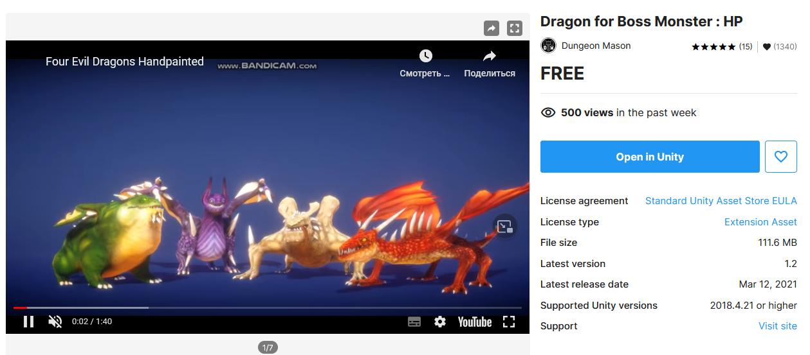
3) Копировать префаб дракона в свою папку и поставить на сцену.<br>
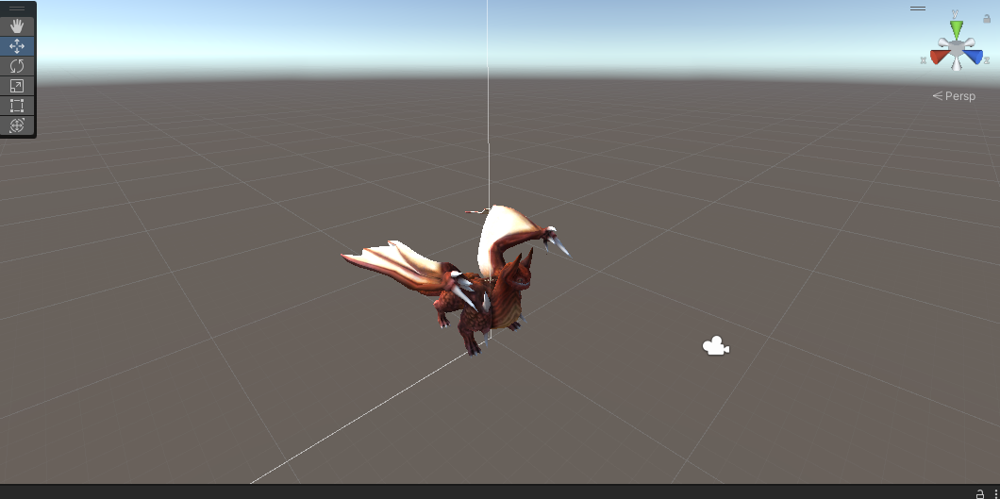
4) Копировать анимацию FlyIDLE, создать Animator controller, закинуть в него анимацию. Добавить его в компонент Animator у дракона<br>
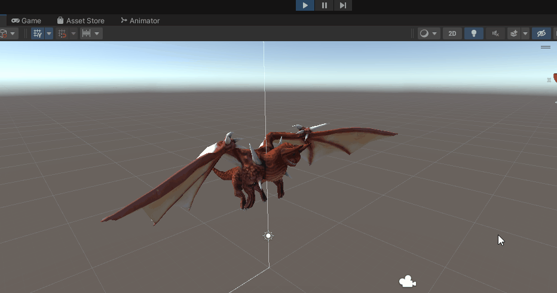
5) Создать сферу, удлинить ее по Y, добавить ей компонент RigitBody, в компоненте Mesh Renderer добавить материал для текстуры из скачанных ранее ассетов. Сохранить яйцо как префаб DragonEgg<br>
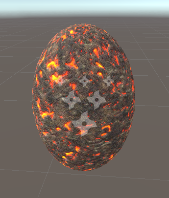
6) Создать сферу, добавить на нее текстуру из скачанных ранее ассетов, сохранить ее как префаб EnergyShield<br>
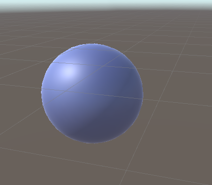
7) Переместить камеру так, чтобы она смотрела на дракона
8) Создать новый скрипт EnemyDragon и добавит его дракону

```cs
public class EnemyDragon : MonoBehaviour
{
    public GameObject DragonEggPrefab;
    public float speed = 1f;
    public float timeBetweenEggDrops = 1f;
    public float leftRightDistance = 10f;
    public float chanceDirection = 0.03f;

    private void Start()
    {
        Invoke("DropEgg", 2f);
    }

    private void DropEgg()
    {
        var diff = new Vector3(0, 0.5f, 0);
        var egg = Instantiate<GameObject>(DragonEggPrefab);
        egg.transform.position = diff + transform.position;
        Invoke("DropEgg", timeBetweenEggDrops);
    }

    void Update()
    {
        Vector3 pos = transform.position;
        pos.x += speed * Time.deltaTime;
        transform.position = pos;

        if(pos.x < -leftRightDistance)
        {
            speed = Mathf.Abs(speed);
        }
        else if(pos.x > leftRightDistance)
        {
            speed = -Mathf.Abs(speed);
        }
    }

    private void FixedUpdate()
    {
        if(UnityEngine.Random.value < chanceDirection)
        {
            speed *= -1;
        }
    }
}
```

9)  Настроить скрипт<br>
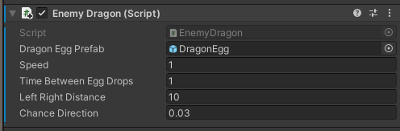<br>
10) Создать объект Plane, добавит ему текстуру, в Mesh Collider поставить как тригерр
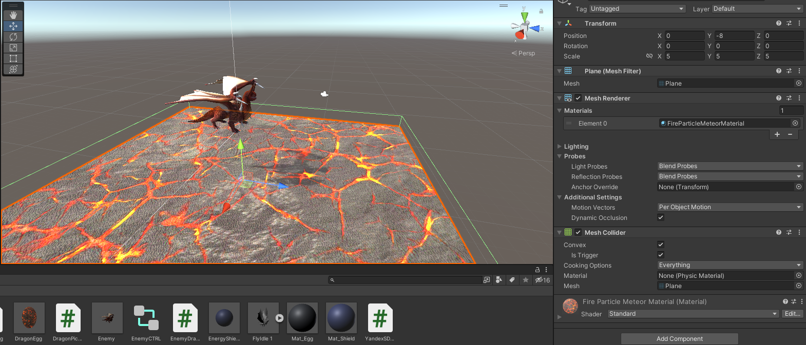<br>
11) Создать скрипт DragonEgg, прикрепить его к префабу яйца<br>
``` cs
public class DragonEgg : MonoBehaviour
{
    public static float bottomY = -30;
    void Start()
    {
        
    }

    private void OnTriggerEnter(Collider other)
    {
        var ps = GetComponent<ParticleSystem>();
        var em = ps.emission;
        em.enabled = true;

        var rend = GetComponent<Renderer>();
        rend.enabled = false;
    }

    void Update()
    {
        if(transform.position.y < bottomY)
        {
            Destroy(this.gameObject);
        }
    }
}
```
12) Добавить к префабу DragonEgg компонент Particle System и настроить его<br>
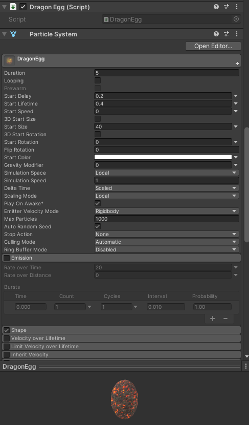<br>
13) Создать скрипт DragonPicker, прикрепить его к Main Camera, закинуть в него префаб EnergyShield<br>
```cs
public class DragonPicker : MonoBehaviour
{
    public GameObject energyShieldPrefab;
    public int numEnergyShield = 3;
    public float energyShieldBottomY = -6f;
    public float energyShieldRadius = 1.5f;
    void Start()
    {
        for (var i = 1; i<= numEnergyShield; i++)
        {
            var tShieldGo = Instantiate(energyShieldPrefab);
            tShieldGo.transform.position = new Vector3(0, energyShieldBottomY, 0);
            tShieldGo.transform.localScale = new Vector3(i, i, i);
        }
    }
}
```

## Задание 2
1) Импортировать PluginYG в свой проект
2) Добавить на сцену объект YandexGame
3) Создать Скрипт YandexSDKController и добавить его к пустому объекту на сцене
```cs
public class YandexSDKManager : MonoBehaviour
{
    public TextMeshProUGUI textBox;
    public UnityEvent authorizationEvent;

    private bool isFirstLaunch = true;
    public void AuthorizationSuccessfull()
    {
        textBox.text = $"Authorization successfull. Hello, {YandexGame.playerName}!";
    }

    public void AuthorizationFailed()
    {
        textBox.text = "Authorization failed.";
    }

    private void OnEnable()
    {
        YandexGame.GetDataEvent += ReceiveSDKData;
    }

    private void OnDisable()
    {
        YandexGame.GetDataEvent -= ReceiveSDKData;
    }

    public void ReceiveSDKData()
    {
        if(YandexGame.SDKEnabled && isFirstLaunch)
        {
            textBox.text = "SDK enabled. Waiting for authorization.";
            isFirstLaunch = false;
            authorizationEvent.Invoke();
        }
    }
}
```
4) Настроить его<br>
   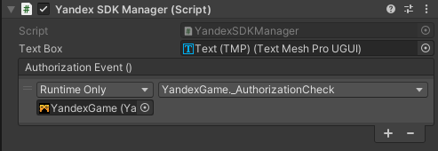
5) В объекте YandexGame добавить ссылки на наши методы<br>
   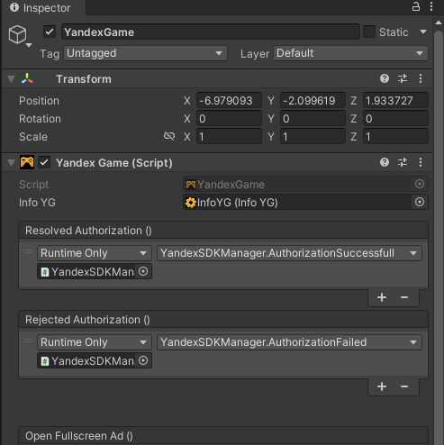
6) Настроить билд: Player "Run in Background" убирам галочку; Player "WebGL Templete" ставим PluginYG; Publishing Settings "Decompression Fallback" ставим галочку.
7) Билдим и архивируем полученный билд
8) Заходим в консоль разработчика Яндекс.Игры, Добавить приложение.
9)  Добавляем архив с билдом в Исходники, Сохраняем
    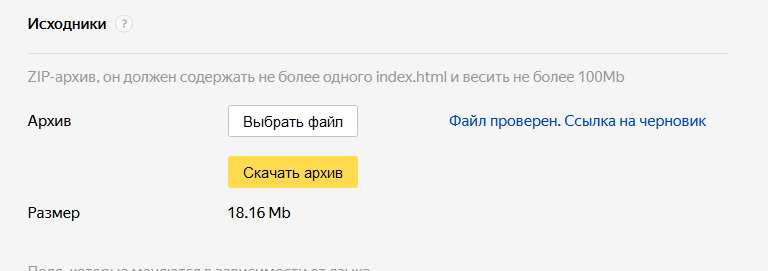
10) Игру моно запустить по ссылке https://yandex.ru/games/app/198458?draft=true&lang=ru
11) Проходит авторизация, что свидетельствует о подключенном YandexSDK, отображается правильное имя пользователя
    
# Выводы
Узнал, как интегрировать игровые сервисы в свой юнити проект и как публиковать свой проект на Яндекс.Играх
## Powered by

**BigDigital Team: Denisov | Fadeev | Panov**


   


